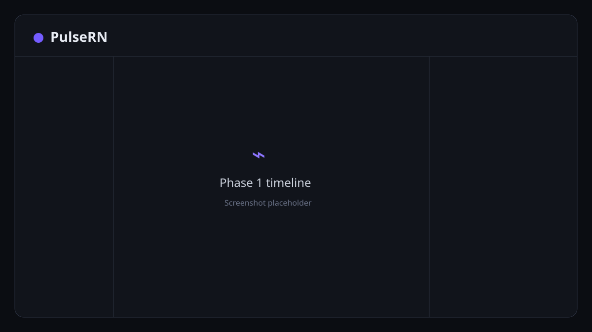

# PulseRN

PulseRN is an open-source desktop debugging foundation for React Native. Its central idea is a unified, chronological timeline that will correlate app interactions, navigation, Redux, network, rendering, performance, and errors.

> Status: Phase 8. The Foundation, Console, Network, Redux, Navigation, Performance, Storage, and Errors inspectors are working.

## What works today

- Electron desktop app with a sandboxed renderer and narrow preload bridge
- Loopback-only WebSocket server on port `9090`
- Versioned JSON protocol with Zod validation and negotiation
- React Native SDK with development-build protection, reconnection, batching, sequencing, bounded offline buffering, payload limits, and field redaction
- Multiple connected-device tracking
- SQLite event persistence
- Initial unified timeline and event-detail view
- Console interception for log, info, warn, error, and debug
- Console filtering, search, pause, clear, payload expansion, copy, source, and stack inspection
- Fetch and XMLHttpRequest inspection with optional Axios interceptors
- Network status/method filters, URL search, failed-request highlighting, body truncation, and detail tabs
- Redux/Redux Toolkit middleware with action, state, diff, reducer timing, redaction, and multi-store inspection
- React Navigation and manual route instrumentation with lifecycle events, nested routes, parameter redaction, and route timing
- Performance monitoring with approximate JS FPS, event-loop lag/stalls, startup/screen/custom timing, optional available heap metrics, and correlated slow-operation views
- AsyncStorage and MMKV inspection with provider discovery, key search/read/refresh, JSON redaction, type-preserving MMKV edits, and explicitly confirmed update/delete operations
- Error inspection for uncaught JavaScript failures, unhandled rejections, React error boundaries, network failures, and SDK errors with stack traces and 20 preceding timeline events
- Persistent desktop settings for system/light/dark themes, interface density, timeline ordering, launch at login, and macOS background behavior
- Compact, rounded light and dark application icons that follow the selected theme, including live macOS system-theme changes
- Expo development-build example covering Console, Network, Redux, Navigation, Performance, AsyncStorage, MMKV, and Errors



## Requirements

- Node.js 20.19 or newer (Node 22 LTS recommended)
- pnpm 10.14
- Xcode for the iOS simulator, or Android Studio for the Android emulator

## Install and run

```bash
pnpm install
pnpm dev:desktop
```

In a second terminal:

```bash
pnpm --filter @pulse-rn/example-react-native ios
# or
pnpm --filter @pulse-rn/example-react-native android
```

The first `ios` or `android` run generates and installs a custom Expo development build containing
MMKV and its Nitro native module. Expo Go cannot run this example. After the development app is
installed, use the following command for normal Metro restarts:

```bash
pnpm --filter @pulse-rn/example-react-native dev
```

If native dependencies change, rebuild the development app with the `ios` or `android` command
instead of only restarting Metro.

Use `10.0.2.2` for the Android emulator, `127.0.0.1` for the iOS simulator, and the desktop machine's LAN address for a physical device:

```bash
EXPO_PUBLIC_PULSE_RN_HOST=192.168.1.20 pnpm --filter @pulse-rn/example-react-native dev
```

The server deliberately binds to loopback in Phase 1. To use a physical device, the desktop host binding must first be made configurable with authentication; see [SECURITY.md](docs/SECURITY.md).

## Verify

```bash
pnpm typecheck
pnpm test
pnpm build
pnpm lint
```

## SDK setup

```ts
import { ReactNativeDevTool } from '@pulse-rn/sdk';

if (__DEV__) {
  ReactNativeDevTool.configure({
    host: '127.0.0.1',
    port: 9090,
    appName: 'ExampleApp',
    redaction: { fields: ['password', 'token'] },
  }).connect();
}
```

See [SDK integration](docs/SDK-INTEGRATION.md), [architecture](docs/ARCHITECTURE.md), and the [roadmap](docs/ROADMAP.md).

## Desktop preferences

Open **Settings** in the Electron sidebar to configure:

- System, dark, or light appearance
- Comfortable or compact interface density
- Newest-first or oldest-first timeline ordering
- Launch at login on packaged macOS builds
- Whether closing the window keeps PulseRN running in the background

Appearance changes apply immediately to the debugger, header branding, window icon, and macOS Dock
icon. With **System** selected, PulseRN follows macOS automatically.

## Known limitations

- The transport only accepts validated JSON and has no authentication UI.
- The UI keeps the latest 2,000 events in memory; database pagination and list virtualization arrive before high-volume instrumentation.
- The example uses Expo prebuild; generated `ios/` and `android/` projects stay local and are not committed.
- Session export/import is not implemented yet.
- Console fields, network headers, URL query parameters, and structured request/response fields are redacted before transmission.
- Performance FPS, event-loop, and SDK app-start metrics are JavaScript-derived approximations, not native CPU or UI-thread profiling.

## Contributing

Contributions are welcome. Read [CONTRIBUTING.md](CONTRIBUTING.md), [DEVELOPMENT.md](docs/DEVELOPMENT.md), and [SECURITY.md](docs/SECURITY.md) before opening a change. PulseRN is licensed under the [MIT License](LICENSE).
