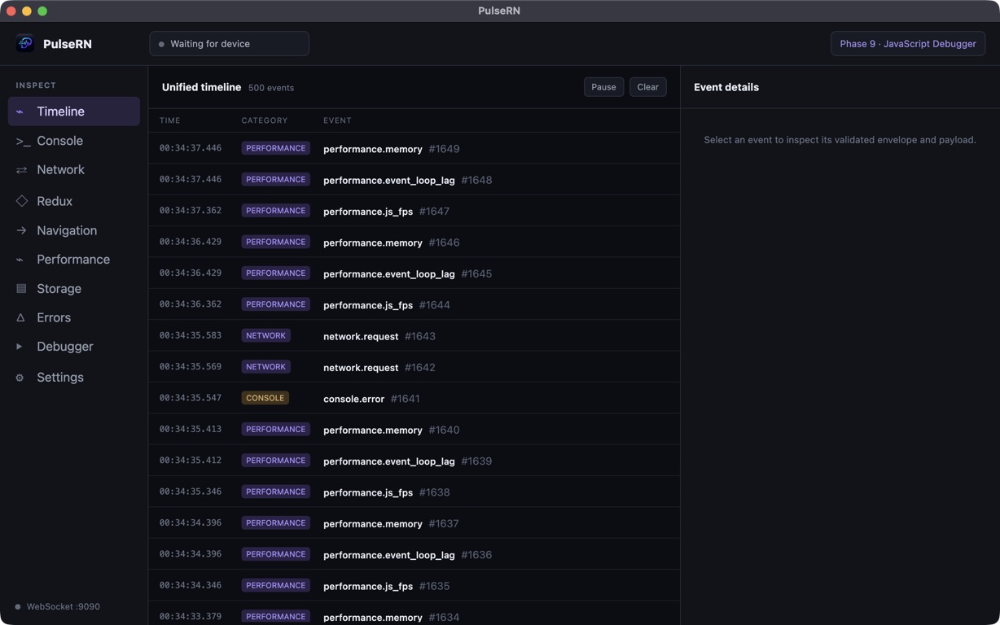
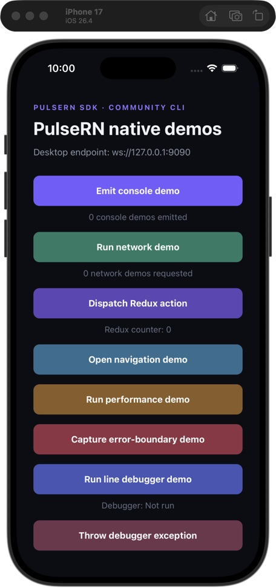
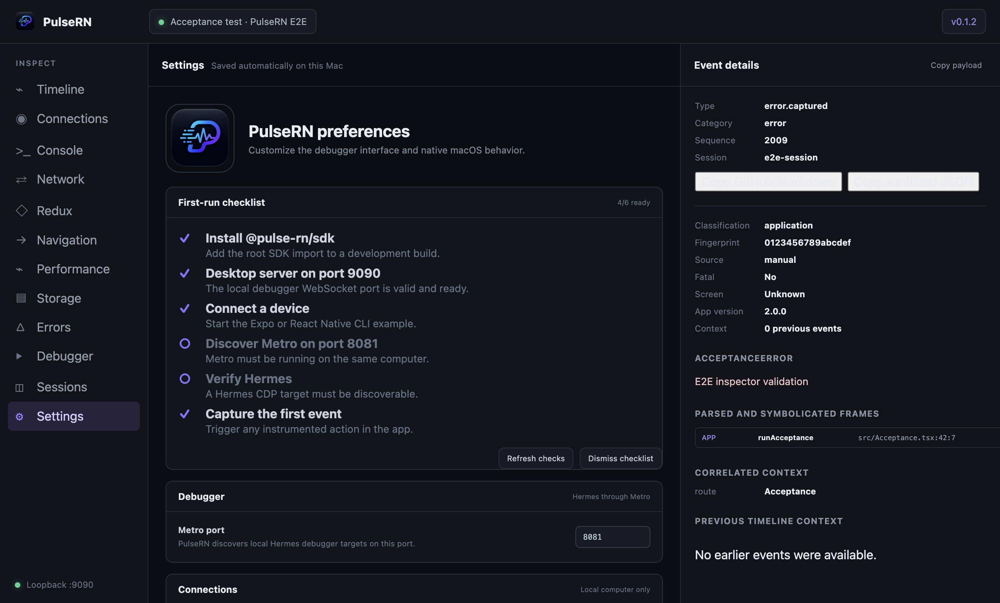

# PulseRN

[](https://www.npmjs.com/package/@pulse-rn/sdk)
[](https://github.com/maahibhama/PulseRN/releases)
[](LICENSE)

[Website and documentation](https://maahibhama.github.io/PulseRN-Site/)

PulseRN is an open-source React Native debugger available as a cross-platform desktop application
and a Node-powered browser interface. It brings JavaScript, native platform, network, navigation,
Redux, storage, performance, and error activity into one chronological debugging timeline.

> Status: PulseRN provides a production-ready local debugger, React Native SDK, browser CLI,
> native iOS Simulator and Android Emulator log capture, secure device pairing, native Hermes
> debugging, persistent sessions, cross-platform packaging, signed-release support, checksums, SPDX
> SBOMs, GitHub provenance, and coordinated CLI, SDK, and desktop release automation.

## What works today

- Electron desktop app with a sandboxed renderer and narrow preload bridge
- Node-powered browser debugger with the same inspectors, persistence, and native-log capture as the desktop app
- Loopback-default WebSocket server with opt-in, one-time LAN pairing, revocable trusted devices, and optional TLS
- Versioned JSON protocol with Zod validation and negotiation
- React Native SDK with development-build protection, reconnection, batching, sequencing, bounded offline buffering, socket backpressure protection, transport health diagnostics, payload limits, and field redaction
- Multiple connected-device tracking
- SQLite event persistence with configurable age/count retention and recovery cleanup
- Cursor-paginated unified timeline with database filters, saved views, bookmarks, annotations, correlations, Follow Latest, keyboard navigation, and bounded virtualization
- Compressed, versioned, checksummed `.pulsern` archive import/export through native file dialogs
- Guarded desktop update checks, explicit download/install controls, and signing-aware release builds
- Console interception for log, info, warn, error, and debug
- Console repeat collapsing, level/source presets, multiline search, lazy structured values, session boundaries, redaction/truncation indicators, copy/source/stack inspection, and capture/drop limits
- Native iOS Simulator and Android Emulator logs associated with the connected app process, including live status, level/search/source filters, batching, truncation, rate limits, restart reattachment, and session persistence
- Fetch and XMLHttpRequest lifecycle inspection with optional Axios interceptors while preserving
  the completed protocol v1 event
- Network in-flight progress, redirect chains, initiators, correlations, waterfall timing,
  URL/header/query search, lazy body views, sanitized cURL/HAR export, and per-body/request/session
  capture budgets
- Redux/Redux Toolkit middleware with bounded state capture, lazy action/state trees, searchable
  diffs and changed paths, size warnings, reducer timing, redaction, per-store policies, action
  allow/deny filters, correlations, and multi-store inspection
- React Navigation, Expo Router, and manual route instrumentation normalized into complete route
  paths and nested ownership trees with history, duration charts, parameter diffs, grouped actions,
  parameter redaction, correlations, and tracking-quality warnings
- Performance monitoring with bounded time-series views, selectable ranges, configurable
  thresholds, matching-session baselines, sampling-loss visibility, approximate JS FPS,
  event-loop lag/stalls, startup/screen/custom timing, optional available heap metrics, explicit
  capability gaps, and correlated slow-operation views
- AsyncStorage and MMKV inspection with provider capabilities, paginated keys, lazy values, typed
  validation, JSON redaction, read-only snapshots, confirmed mutations, opaque single-session undo,
  local audits, and explicitly selected safe export
- Grouped error inspection with stable fingerprints, occurrence/version/regression state,
  parsed application and React component frames, route/request/Redux/console/performance context,
  ownership classification, and re-redacted GitHub Markdown/JSON issue reports
- Native Hermes JavaScript debugger with original TypeScript sources, target reload recovery,
  optional-CDP negotiation, hierarchy/quick-open/blackboxing, inline paused values, lazy searchable
  scopes, watches/evaluation, and conditional, hit-count, log, and verified breakpoints
- Local authenticated [MCP debugger](docs/MCP.md) for Claude, Codex, Cursor, and other AI clients
- Built-in and custom desktop themes with system light/dark pairing, accessible accent gradients,
  separate UI/code fonts, local font import, and portable theme JSON
- Compact, rounded light and dark application icons that follow the selected theme, including live macOS system-theme changes
- Expo development-build and bare React Native Community CLI examples covering Console, Network, Redux, Navigation, Performance, AsyncStorage, MMKV, and Errors
- Optional persistent SDK device identity for stable device history across app launches
- One-version GitHub Actions release coordination for the CLI, SDK, and macOS, Windows, and Linux desktop applications

## Screenshots

### Unified desktop timeline



### React Native Community CLI example

<p align="center">
  
</p>

### Settings and first-run diagnostics



## Requirements

- Node.js 20.19 or newer (Node 22 LTS recommended)
- pnpm 10.14
- Xcode for the iOS simulator, or Android Studio for the Android emulator

## Install the desktop app

PulseRN preview releases are available from
[GitHub Releases](https://github.com/maahibhama/PulseRN/releases). They are currently unsigned, so
macOS Gatekeeper and Windows SmartScreen display a warning.

### Homebrew

```bash
brew tap maahibhama/pulsern https://github.com/maahibhama/PulseRN
brew install --cask --no-quarantine pulsern
```

### macOS DMG

Download `PulseRN-<version>-mac-arm64.dmg` for Apple Silicon (M1 and newer), or
`PulseRN-<version>-mac-x64.dmg` for Intel. Open it and drag PulseRN to Applications. If Gatekeeper
blocks the preview, right-click PulseRN and choose **Open**.

### Windows

Download the x64 installer for most Windows PCs or the ARM64 installer for Windows on ARM. If
SmartScreen appears, select **More info** and then **Run anyway**.

### Linux

Use the portable AppImage:

```bash
chmod +x PulseRN-<version>-linux-x64.AppImage
./PulseRN-<version>-linux-x64.AppImage
```

Or install the Debian package:

```bash
sudo apt install ./PulseRN-<version>-linux-x64.deb
```

See [desktop installation](docs/INSTALLATION.md) for verification, upgrades, and uninstall
instructions.

## Run in a browser

React Native developers with Node.js 22.5 or newer can run the same debugger UI without installing
the Electron application. Run the published CLI directly:

```bash
npx @maahibhama/pulsern
```

On macOS, Homebrew can install both a compatible Node runtime and the PulseRN CLI:

```bash
brew tap maahibhama/pulsern https://github.com/maahibhama/PulseRN
brew install maahibhama/pulsern/pulsern-cli
pulsern
```

The first command adds the PulseRN repository as a Homebrew tap. It only needs to be run once on a
computer. After installation, run `pulsern` whenever you want to start the debugger. PulseRN opens
the browser automatically and keeps running in the terminal until you press `Ctrl+C`.

Alternatively, install Node first and continue using `npx`:

```bash
brew install node
npx @maahibhama/pulsern
```

The command opens `http://localhost:3000`, receives SDK connections on port `9090`, stores history
locally, and runs until you press `Ctrl+C`. Use `pulsern --help` after a Homebrew installation, or
`npx @maahibhama/pulsern --help` when using npx, for custom ports, Metro host configuration, a
custom data directory, or headless startup. See the
[local web debugger guide](docs/WEB-CLI.md) for emulator, physical-device, security, and persistence
details.

## Release CLI, SDK, and desktop together

Maintainers can publish all three products from one GitHub Actions workflow:

1. Open **GitHub → Actions → Release all**.
2. Select **Run workflow**.
3. Enter one version without a `v` prefix, for example `1.0.7`.

The coordinated workflow updates and commits every shared release version, including the CLI and
SDK runtime constants, desktop package metadata, Homebrew Formula URL, Cask, and lockfile. It then
starts the existing release workflows in parallel with these tags:

- `cli-v1.0.7` publishes `@maahibhama/pulsern` and the CLI GitHub/Homebrew artifacts.
- `sdk-v1.0.7` publishes `@pulse-rn/sdk`.
- `v1.0.7` builds and publishes the macOS, Windows, and Linux desktop applications.

The requested version must not already have any of these release tags. Individual release
workflows remain available for recovery or when only one product needs to be published. The
coordinator is defined in [`.github/workflows/release-all.yml`](.github/workflows/release-all.yml).

## Develop locally

```bash
pnpm install
pnpm dev:desktop
```

Contributors can build and run the browser edition from the checked-out source:

```bash
pnpm dev:web
```

`pnpm dev:web` is a development command, not an end-user installation method.

In a second terminal:

```bash
# Expo development build
pnpm --filter @pulse-rn/example-react-native ios
# or
pnpm --filter @pulse-rn/example-react-native android

# Bare React Native Community CLI
pnpm --filter @pulse-rn/example-react-native-cli ios
# or
pnpm --filter @pulse-rn/example-react-native-cli android
```

The first `ios` or `android` run generates and installs a custom Expo development build containing
MMKV and its Nitro native module. Expo Go cannot run this example. After the development app is
installed, use the following command for normal Metro restarts:

```bash
pnpm --filter @pulse-rn/example-react-native dev
```

If native dependencies change, rebuild the development app with the `ios` or `android` command
instead of only restarting Metro.

Use `10.0.2.2` for the Android emulator and `127.0.0.1` for the iOS simulator. For a physical device,
enable authenticated LAN connections in desktop Settings, open **Connections**, create a short-lived
pairing code, then run:

```bash
EXPO_PUBLIC_PULSE_RN_HOST=192.168.1.20 \
EXPO_PUBLIC_PULSE_RN_PAIRING_CODE=<pairing-code> \
EXPO_PUBLIC_PULSE_RN_SECURE=true \
pnpm --filter @pulse-rn/example-react-native dev
```

The pairing code works once. PulseRN returns a reconnect token after successful pairing; applications
should store it in platform secure storage and provide it as
`EXPO_PUBLIC_PULSE_RN_RECONNECT_TOKEN` during later development launches. Revoke a trusted device
from the Connection Center at any time.

Set `EXPO_PUBLIC_PULSE_RN_SECURE=true` only after configuring TLS in desktop Settings. The device
must trust the certificate authority and the certificate must cover the selected host or IP. Without
TLS, LAN traffic uses plain `ws://` and must stay on a trusted development network. See
[SECURITY.md](docs/SECURITY.md).

## Verify

```bash
pnpm typecheck
pnpm test
pnpm build
pnpm lint
```

## SDK setup

The React Native SDK is published publicly on
[npm](https://www.npmjs.com/package/@pulse-rn/sdk). npm is the official package registry; no
GitHub Packages configuration or authentication token is required.

```bash
npm install @pulse-rn/sdk
```

Equivalent commands:

```bash
pnpm add @pulse-rn/sdk
# or
yarn add @pulse-rn/sdk
```

```ts
import {
  createDevToolMiddleware,
  createNavigationTracker,
  ReactNativeDevTool,
} from '@pulse-rn/sdk';

if (__DEV__) {
  ReactNativeDevTool.configure({
    host: '127.0.0.1',
    port: 9090,
    appName: 'ExampleApp',
    redaction: { fields: ['password', 'token'] },
  }).connect();
}
```

See [SDK integration](docs/SDK-INTEGRATION.md), [session archives](docs/SESSION-ARCHIVES.md),
[architecture](docs/ARCHITECTURE.md), and the [roadmap](docs/ROADMAP.md). Source code, issues, and contributions live in the
[GitHub repository](https://github.com/maahibhama/PulseRN); downloadable desktop builds are
published through [GitHub Releases](https://github.com/maahibhama/PulseRN/releases).

## Desktop preferences

Open **Settings** in the Electron sidebar to configure:

- System, dark, or light appearance and system/reduced/full motion
- Comfortable or compact interface density
- Newest-first or oldest-first timeline ordering
- Local Metro discovery port for the Hermes debugger
- Debugger server port, authenticated LAN access, bounded pairing lifetime/retries, and TLS
  certificate configuration
- Console/network capture budgets, diagnostic intervals, and sensitive-field redaction
- Persisted performance alert thresholds
- Stable or beta update channel
- Signed-build update checks, download progress, and confirmed restart/install
- Event retention period, maximum stored events, maintenance, and history deletion
- Launch at login on packaged macOS builds
- Whether closing the window keeps PulseRN running in the background

Appearance changes apply immediately to the debugger, header branding, window icon, and macOS Dock
icon. With **System** selected, PulseRN follows macOS automatically.

## Session archives

Open **Sessions** to browse retained runs, export one session or all stored sessions, and import a
`.pulsern` archive. PulseRN validates its manifest, relationships, decompression bounds, and per-entry
checksums in Electron main before writing any data transactionally. Imports are duplicate-safe and
remain subject to the configured retention limits.

## JavaScript line debugger

Open **Debugger**, refresh Metro targets, and select a Hermes development runtime. PulseRN supports
React Native 0.76+ development builds and defaults to Metro on `127.0.0.1:8081`; change the port in
Settings when needed. Pause on original TypeScript, hover variables for selected-frame values, use
the live bottom REPL, expand scopes and watches lazily, and record JavaScript render costs. The
**Components** workbench provides a read-only React tree with props, state, hooks, styles,
accessibility metadata, and source navigation when the development runtime exposes React DevTools
Fiber roots. See [JavaScript debugger](docs/JAVASCRIPT-DEBUGGER.md) for breakpoint controls,
keyboard shortcuts, component inspection, examples, and current limitations.

## Known limitations

- TLS requires a user-supplied certificate and private key; PulseRN does not create or install a
  trusted certificate authority on mobile devices.
- Automatic installation remains disabled in development and unsigned preview builds. Maintainers
  must configure the documented Apple and Windows signing secrets before publishing signed updates.
- Live updates keep a bounded 2,000-event projection in memory; inspectors page older retained history from SQLite.
- The Expo example uses prebuild; the Community CLI example includes committed native iOS and Android projects.
- Console fields, network headers, URL query parameters, and structured request/response fields are redacted before transmission.
- Performance FPS, event-loop, and SDK app-start metrics are JavaScript-derived approximations, not native CPU or UI-thread profiling.

## Contributing

Contributions are welcome. Read [CONTRIBUTING.md](CONTRIBUTING.md),
[DEVELOPMENT.md](docs/DEVELOPMENT.md), [COMPATIBILITY.md](docs/COMPATIBILITY.md),
[SUPPORT.md](SUPPORT.md), and [SECURITY.md](docs/SECURITY.md) before opening a change. PulseRN is
licensed under the [MIT License](LICENSE).
